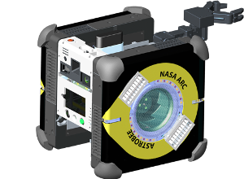

# Astrobee Robot Software

### About

Astrobee is a free-flying robot designed to operate as a payload inside
the International Space Station (ISS). The Astrobee Robot Software consists of
embedded (on-board) software, supporting tools and a simulator. The Astrobee
Robot Software operates on Astrobee's three internal single board computers and
uses the open-source Robot Operating System (ROS) framework as message-passing
middleware. The Astrobee Robot Software performs vision-based localization,
provides autonomous navigation, docking and perching, manages various sensors
and actuators, and supports user interaction via screen-based displays, light
signaling, and sound. The Astrobee Robot Software enables Astrobee to be
operated in multiple modes: plan-based task execution (command sequencing),
teleoperation, or autonomously through execution of hosted code uploaded by
project partners (guest science). The software simulator enables Astrobee Robot
Software to be evaluated without the need for robot hardware.

This repository provides flight software and a simulator, both primarily written
in C++. The repository also provides several other utilities, including a tool
for creating maps for localization. A separate repository,
[`astrobee_android`](https://github.com/nasa/astrobee_android), contains the
Java API, which uses the ROS messaging system to communicate with flight
software.

The Astrobee Robot Software is in a beta stage. This means that some
features are incomplete, and extensive changes can be expected. Please consult
[RELEASE](RELEASE.md) for the current list of features and limitations.

### Usage instructions

If you don't have access to NASA's internal network, please see the
[usage instructions](INSTALL.md).

If you do, please see the [NASA usage instructions](NASA_INSTALL.md).

### Contributors

The Astrobee Robot Software is open source, and we welcome contributions
from the public. However, for us to merge any pull requests, we must request
that contributors sign and submit a
[Contributor License Agreement](https://www.nasa.gov/sites/default/files/atoms/files/astrobee_individual_contributor_license_agreement.pdf)
due to NASA legal requirements. Thank you for your understanding.

### Documentation

To view the Astrobee documentation, visit [documentation](https://nasa.github.io/astrobee/html/documentation.html)

For familiarization with the Astrobee project, it is recommended to read some
background papers:

#### Astrobee Software Concepts
[Lorenzo Fluckiger, Kathryn Browne, Brian Coltin, Jesse Fusco, Theodore Morse,
and Andrew Symington. “Astrobee Robot Software: Enabling Mobile Autonomy on the 
ISS”, *In Proc. of the Int. Symposium on Artificial Intelligence, Robotics and 
Automation in Space (i-SAIRAS)*, 2018.](
https://www.nasa.gov/sites/default/files/atoms/files/fluckiger2018astrobee.pdf)

#### Localization method
[Brian Coltin et al. “Localization from visual landmarks on a free-flying
robot”. *In: Intelligent Robots and Systems (IROS), 2016 IEEE/RSJ International
Conference on. IEEE.* 2016, pp. 4377–4382.](
https://www.nasa.gov/sites/default/files/atoms/files/coltin2016localization.pdf)

#### Astrobee platform
[Maria Bualat et al. "Astrobee: A New Tool for ISS Operations." *2018 
SpaceOps Conference*. 2018.](
https://www.nasa.gov/sites/default/files/atoms/files/bualat_spaceops_2018_paper.pdf)

### Guest Science

If you are interested in guest science, please do one of the following for more
information.

If you are a non-NASA user, please checkout the astrobee_android nasa github
project (if you followed the usage instructions, you should have checked this
out already). Once that is checked out, please see
[`astrobee_android/README.md`](https://github.com/nasa/astrobee_android/blob/master/README.md)
located in the `astrobee_android/` folder.

If you are a NASA user, please make sure the `android` submodule was checked out
and then visit `submodules/android/guest_science_readme.md`.

### License

Copyright (c) 2017, United States Government, as represented by the
Administrator of the National Aeronautics and Space Administration.
All rights reserved.

The Astrobee platform is licensed under the Apache License, Version 2.0 (the
"License"); you may not use this file except in compliance with the License. You
may obtain a copy of the License at http://www.apache.org/licenses/LICENSE-2.0.

Unless required by applicable law or agreed to in writing, software distributed
under the License is distributed on an "AS IS" BASIS, WITHOUT WARRANTIES OR
CONDITIONS OF ANY KIND, either express or implied. See the License for the
specific language governing permissions and limitations under the License.
