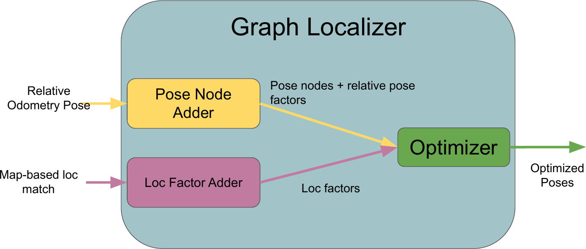

\page graphlocalizer Graph Localizer 

# Package Overview
Performs sliding-window graph based optimization using a LocFactorAdder. Uses a PoseNodeAdder for creating pose nodes at required timestamps using relative odometry measurements.

# Background
For more information on the theory behind the GraphLocalizer and the factors used, please see our paper: 
* Ryan Soussan, Varsha Kumar, Brian Coltin, and Trey Smith, "Astroloc: An efficient and robust localizer for a free-flying robot", Int. Conf. on Robotics and Automation (ICRA), 2022. [Link](https://ieeexplore.ieee.org/stamp/stamp.jsp?tp=&arnumber=9811919 "Link")

# Graph Optimization Structure 

## Factor Adders
* LocFactorAdder
## Graph Factors
* gtsam::BetweenFactor<gtsam::Pose3> 
* LocPoseFactor 
* LocProjectionFactor 
## Node Adders
* PoseNodeAdder 
