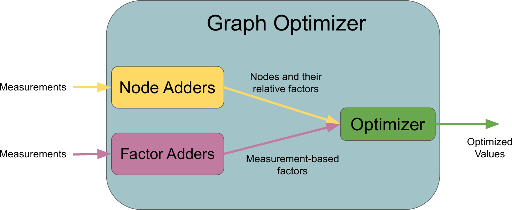

\page graphoptimizer Graph Optimizer

# Package Overview
The graph optimizer contains factor and node adders and uses these to generate factors and nodes for optimization. During an optimize call, it queries each factor adder and adds new factors and nodes to an internal factor graph before calling the respective optimizer. See the factor_adder and node_adder packages for more information on each of these classes.

