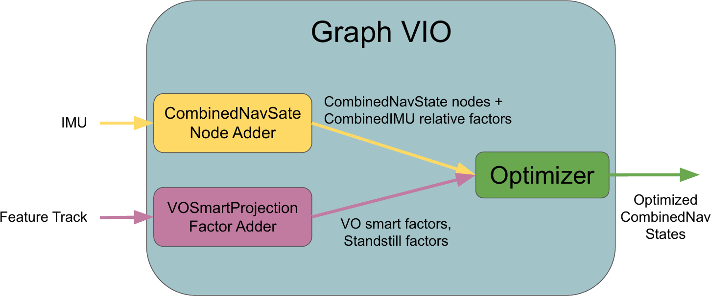

\page graphvio Graph VIO

# Package Overview
Performs sliding-window graph based visual-intertial odometry (VIO) using a VOSmartProjectionFactorAdder and StandstillFactorAdder. Uses a CombinedNavStateNodeAdder for creating combined nav state nodes (containing a pose, velocity, and IMU bias) at required timestamps using IMU measurements. Optionally adds depth image correspondences as point-to-point between factors.

# Background
For more information on the theory behind the GraphVIO and the factors used, please see our paper: 
* Ryan Soussan, Varsha Kumar, Brian Coltin, and Trey Smith, "Astroloc: An efficient and robust localizer for a free-flying robot", Int. Conf. on Robotics and Automation (ICRA), 2022. [Link](https://ieeexplore.ieee.org/stamp/stamp.jsp?tp=&arnumber=9811919 "Link")

# Graph Optimization Structure 

## Factor Adders
* DepthOdometryFactorAdder
* VoSmartProjectionFactorAdder
* StandstillFactorAdder 
## Graph Factors
* Point BetweenFactors (for depth odometry correspondences)
* CombinedIMUFactor
* RobustSmartProjectionFactor
* Standstill Factors (zero velocity prior and identity relative transform between factors)
## Node Adders
* CombinedNavStateNodeAdder
