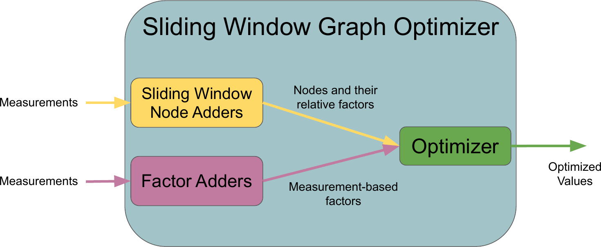

\page slidingwindowgraphoptimizer Sliding Window Graph Optimizer

# Package Overview
The SlidingWindowGraphOptimizer class extends the graph optimizer and uses sliding window node adders to perform graph-based optimization. In each Update() call, it adds new factors and nodes from respective factor and node adders and slides the window before or after optimization as desired. Sliding the window consists of removing old nodes and their dependent factors as determined by the set max desired window duration and number of states in the provided params. See the node_adder package for more information on the SlidingWindowNodeAdder class.

