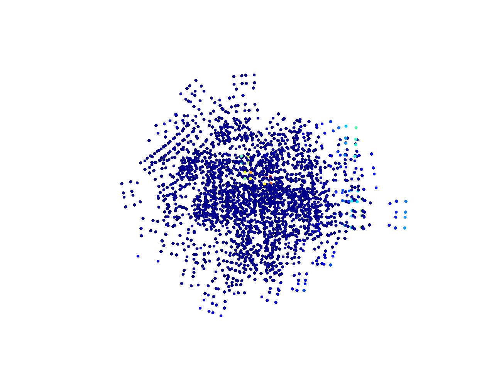

\page calibration Calibration

# Package Overview
# Camera Target Based Intrinsics Calibration 
Calibrating camera intrinsics involves generating target detection files
from a set of bagfiles, generating or providing an initial estimate for the camera intrinsics and distortion values, 
and finally running the calibrator.
Several camera distortion models (fov, rad, radtan) are supported for calibration and various scripts are provided to view the quality of the input target detections and the calibration results.

## Example Usage
### Generate target detections from bagfiles
```rosrun calibration save\_images\_with\_target\_detections -d ~/bag\_files -o target\_detections -t ~/target.yaml``` <br /> 
Here ```~/bag\_files``` contains a directory of bagfiles containing target detection images.
### View target detection coverage in image space
```rosrun calibration view\_all\_detections.py -d target\_detections```<br /> 
```feh detection\_image.jpg```<br /> 
<p align="center">

</p>

Ideally the target detections span the entire image. If only the middle of the image contains detections or if parts of the image have no detections, this may lead to an underconstrained calibration problem.  Ensure good target coverage before attempting to calibrate a camera. <br />
### Calibrate
#### Calibration Parameters 
In addition to the script parameters, the camera\_target\_based\_intrinsics\_calibrator.config contains most of the configuration options for camera target based intrinsics calibration.  The distortion model, camera name, parameters for the reprojection pose estimator handling target pose estimation, visualization, and other general parameters can be selected. <br />
The parameters to calibrate can also be selected.  Depending on the distortion model used, different parameters should be calibrated concurrently to avoid degeneracies and underconstrained calibration.  For example, calibrating the camera principal points and target poses at the same time should be avoided.  Calibration may be repeated while incrementally updating solved parameters and toggling different concurrent parameter sets to solve for until all parameters are adequately calibrated.  
#### Run Calibration
```rosrun calibration calibrate\_intrinsics\_and\_save\_results.py target\_detections ~\/astrobee\/src\/astrobee\/config config\/robots\/bumble.config -u -p -i target\_detections -d fov``` <br />
For more details of the calibration script see below in the Scripts section.
#### Calibration Output
The calibrated results are saved in the calibrated\_params.txt file while more verbose output is saved to the calibration\_output.txt file.  
#### Judging Calibration Results
Rely primarily on the covariances for each calibrated parameter reported at the end of the calibration\_output.txt file. <br />
##### Reprojection Image
The output calibrated\_reprojection\_from\_all\_targets\_absolute\_image.png displays reprojection errors after the calibration procedure has completed and can give a general sense of the calibration accuracy, although it does not discern between accurate calibration and overfitting, which is why the covariances mentioned previously should be the primary indicator of calibration accuracy.<br />
Here reprojection errors are colored by the norm of the error on a continuous color spectrum, with dark blue indicated small/zero error and red indicating large error.  
<p align="center">

</p>

##### Error Histogram
The generated error histogram (which displays the overall norm, x, and y errors on seperate plots) can be helpful to view overall error during calibration and to see if any bias exists in the errors.  For example, if the x or y error histograms are not zero centered, this can indicate an error in the calibrated principal points. <br />
<p align="center">

</p>
<p align="center">

</p>
<p align="center">

</p>

This is generated by passing the -p option to the calibration script or by running the make\_error\_histograms.py script on the output errors.txt file after calibration has completed.

##### Undistorted Images
The undistorted images generated by passing -u to the calibration script or by seperately running the create\_undistorted\_images script give an additional indicator of calibration accuracy.  Undistorted calibration targets should have straight boundary edges and straight lines within the target.  Curved lines can indicate an error in the calibration distortion parameters. <br />

Distorted Image:

<p align="center">

</p>

Undistorted Image (FOV distortion):

<p align="center">

</p>

The black dots in the undistorted image are a result of the FOV undistortion procedure, while the Rad and RadTan uses interpolation to fill these. 


# Tools

## create\_undistorted\_images 
Generates undistorted images from a set of distorted images and provided camera calibration parameters.
See 'rosrun calibration create\_undistorted\_images -h'
for further details and usage instructions.

## run\_camera\_target\_based\_intrinsics\_calibrator
Runs the intrinsics calibrator using a set of target detection files and initial estimates
for the camera intrinsics and distortion values.  Support various distortion models.
See 'rosrun calibration run\_camera\_target\_based\_intrinsics\_calibrator -h'
for further details and usage instructions.

# Scripts

## calibrate\_intrinsics\_and\_save\_results.py  
Runs camera intrinsic calibration using provided target detections and a config file with camera
parameters (including initial estimate for camera intrinsics and distortion values).
See 'rosrun calibration calibrate\_intrinsics\_and\_save\_results.py -h'
for further details and usage instructions.

## copy\_calibration\_params\_to\_config.py      
Helper script that copies calibration parameters from the output of the 
calibration pipeline and writes these to the camera config file.
See 'rosrun calibration copy\_calibration\_params\_to\_config.py -h'
for further details and usage instructions.

## get\_bags\_with\_topic.py    
Helper script that generates a list of bag files in a directory
with the provided topic. 
See 'rosrun calibration get\_bags\_with\_topic.py -h'
for further details and usage instructions.

## make\_error\_histograms.py
Generates a histogram of errors using the output errors from 
the calibration pipeline.
See 'rosrun calibration make\_error\_histograms.py -h'
for further details and usage instructions.

## save\_images\_with\_target\_detections.py
Generates target detection files for use with the calibration 
pipeline from a set of bagfiles containing images of target detections. 
See 'rosrun calibration save\_images\_with\_target\_detections.py -h'
for further details and usage instructions.

## view\_all\_detections.py
Generates an image containing all images space detections of a target
for a set of target detection files.
See 'rosrun calibration view\_all\_detections.py -h'
for further details and usage instructions.
